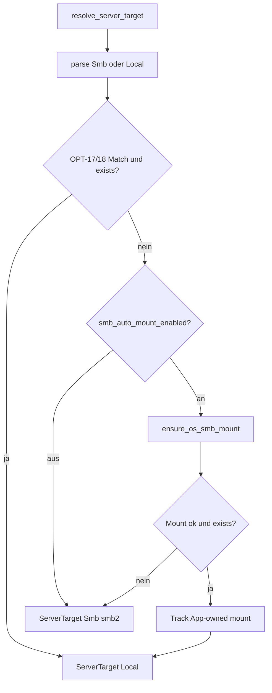

# Aero Tandem Studio v2 — Performance-Optimierungsplan

> **Zweck:** Backlog für gezielte Performance-Verbesserungen, **getrennt** vom Feature-Phasenplan (`IMPLEMENTATION_PLAN.md` / `phases/`).
> In jedem Agent-Kontext mit `@docs/optimization_plan.md` referenzieren und **nur ein OPT-Paket** implementieren.

---

## Inhaltsverzeichnis

1. [Regeln](#1-regeln)
2. [Übersicht & Reihenfolge](#2-übersicht--reihenfolge)
3. [Fortschritts-Tracker](#3-fortschritts-tracker)
4. [OPT-Pakete](#4-opt-pakete)
5. [Bewusst nicht in diesem Plan](#5-bewusst-nicht-in-diesem-plan)

---

## 1. Regeln

- **NIEMALS** Dateien im Legacy-Projekt ändern (nur lesen)
- **Kein Feature-Scope:** Keine neuen Phasen aus `phases/open/` / ARCHIVE anfassen (z. B. Phase 23 MTP, Phase 14 ML)
- **Ein OPT pro Session** — Scope nicht erweitern
- Video-Verarbeitung **NUR** über FFmpeg CLI in Rust
- Nach Rust-Änderungen: `cargo test --manifest-path src-tauri/Cargo.toml`
- Nach Frontend-Änderungen: `npm run check` und manuell `npm run tauri dev`
- Verhalten beibehalten; Optimierung darf UX nicht verschlechtern (Ausnahme: dokumentierte „Fast Preview“-Modi)

### Agent-Schnell-Prompt (Vorlage)

```
Implementiere OPT-X aus @docs/optimization_plan.md
Regeln: @AGENTS.md
Nur OPT-X. Danach cargo test && npm run tauri dev.
```

---

## 2. Übersicht & Reihenfolge

| ID | Titel | Impact | Aufwand | Risiko | Abhängigkeiten |
|----|-------|--------|---------|--------|----------------|
| OPT-0 | Performance-Baseline | — | S | — | — |
| OPT-1 | Foto-Preview: Thumbnails statt Full-Res | hoch | S | niedrig | — |
| OPT-10 | Thumbnail-Warming nach Import staffeln | mittel | S | niedrig | — |
| OPT-8 | Startup: Cache-Sweep im Splash | mittel | S | niedrig | — |
| OPT-2 | Import: paralleles ffprobe + Copy/Probe-Pipeline | hoch | M | mittel | — |
| OPT-3 | Copy-Buffer & optional Hardlink/CoW-Import | hoch | M | mittel | — |
| OPT-7 | Filmstrip/Keyframe-Prefetch | mittel | S | niedrig | — |
| OPT-4 | Thumbnails über HTTP statt Base64-IPC | mittel | M | mittel | — |
| OPT-9 | Encode-Pfad: Stream-Copy & Preview-Reuse UX | hoch | S | niedrig | — |
| OPT-6 | Log-Konsole virtualisieren | niedrig | S | niedrig | — |
| OPT-5 | App.tsx Split + lazy Dialoge | mittel | L | mittel | — |
| OPT-11 | Foto-Import: QR vor Thumbnail-Warming | hoch | S | niedrig | OPT-10 |
| OPT-12 | Foto-Import: paralleles EXIF-Sort + Copy | hoch | M | mittel | OPT-3 |
| OPT-13 | Player/Cutter: libmpv statt HTML5 | — | — | — | **entfernt** (JPEG-IPC laggy; Keyframe-Cuts → HTML5 only) |
| OPT-14 | QR: Cascade-Decode + Sharpness-Gate | hoch | M | mittel | Phase 6 |
| OPT-15 | SMB-Upload: Parallel + Marker-Barrier | hoch | M | mittel | Phase 10 |
| OPT-16 | Compatible-Probe-Cache + Create ohne „Clips prüfen“ | mittel | M | niedrig | Phase 40, OPT-2 |
| OPT-17 | SMB: Windows-Map → Local-Pfad (keine Doppel-Session) | hoch | S | niedrig | Phase 10, Phase 32 |
| OPT-18 | SMB: macOS/Linux OS-Mount → Local-Pfad | mittel | M | mittel | OPT-17 |
| OPT-19 | SMB: Auto-Mount (OS-Map anlegen, App-owned) | hoch | L | mittel | OPT-17, OPT-18 |

**Empfohlene Reihenfolge:** OPT-0 … OPT-19 ✅ — weitere Follow-ups in §5.

---

## 3. Fortschritts-Tracker

| ID | Status |
|----|--------|
| OPT-0 | ✅ |
| OPT-1 | ✅ |
| OPT-2 | ✅ |
| OPT-3 | ✅ |
| OPT-4 | ✅ |
| OPT-5 | ✅ |
| OPT-6 | ✅ |
| OPT-7 | ✅ |
| OPT-8 | ✅ |
| OPT-9 | ✅ |
| OPT-10 | ✅ |
| OPT-11 | ✅ |
| OPT-12 | ✅ |
| OPT-13 | ✅ implementiert → **entfernt** (HTML5 only) |
| OPT-14 | ✅ |
| OPT-15 | ✅ |
| OPT-16 | ✅ |
| OPT-17 | ✅ |
| OPT-18 | ✅ |
| OPT-19 | ✅ |

**Nachher-Messung (2026-08-20, v0.2.17, Windows 11, libx264):** Vollständige Tabelle → **`docs/PERF_BASELINE.md`** (Abschnitt „Nach OPT-0 … OPT-10“).

| Szenario | OPT-0 Backend | Nach OPT-0…10 | Kurz |
|----------|---------------|---------------|------|
| S1 Import 10×6 MB | 4,45 s | **0,25 s** | −94 % (par. Probe, Hardlink, async Thumbs) |
| S2 Preview (1×30 s Proxy) | 10,13 s | 10,07 s | Encode unverändert (erwartet) |
| S3 Create mit Preview-Reuse | 0,02 s | 0,01 s | Reuse weiterhin instant |
| S3 Create ohne Reuse | 9,76 s | 10,10 s | Encode unverändert (erwartet) |

---

## 4. OPT-Pakete

---

### OPT-0: Performance-Baseline

**Ziel:** Messbare Ausgangswerte dokumentieren, bevor Optimierungen gemessen werden.

**Impact:** — (Voraussetzung für valide Vorher/Nachher-Vergleiche)  
**Aufwand:** S  
**Risiko:** —  
**Abhängigkeiten:** keine

#### Kontext

- Bottleneck-Analyse (2026-02): FFmpeg Encode/Import dominieren; Frontend `App.tsx` ist Re-Render-Risiko.
- Ohne Baseline ist unklar, ob spätere OPTs wirken.

#### Scope

**In scope:**

- [x] Abschnitt „Baseline“ in dieser Datei (oder `docs/PERF_BASELINE.md`) mit Tabellenwerten → **`docs/PERF_BASELINE.md`**
- [x] Drei feste Szenarien definieren und einmal messen (Stopwatch + optional Rust-Log-Timestamps) → **S1 Import, S2 Preview, S3 Create** (+ S4/S5 ergänzend)
- [x] Plattform notieren (Windows/macOS/Linux), HW-Encoding ja/nein, Clip-Anzahl/-Größe → **Windows 11, libx264, 10×6 MB**

**Out of scope:**

- Code-Änderungen
- Automatisierte Benchmark-CI

#### Mess-Szenarien (Vorlage)

| Szenario | Beschreibung | Metrik |
|----------|--------------|--------|
| S1 Import | 10 Videos (typ. Größe notieren) per Drag&Drop | Sekunden bis Liste vollständig |
| S2 Preview | Preview generieren (Intro an/aus notieren) | Sekunden bis Player spielt |
| S3 Create | Create mit Preview-Reuse vs. ohne | Sekunden bis Erfolg |
| S4 Fotos | 30 Fotos importieren + durchblättern | RAM-Spike / Wechsel-Latenz subjektiv |
| S5 SD-Dialog | SD-Dateiauswahl öffnen (viele Dateien) | Zeit bis Grid scrollbar |

#### Akzeptanzkriterien

- [x] Baseline-Tabelle ausgefüllt (Datum, Plattform, Version) — siehe **`docs/PERF_BASELINE.md`**
- [x] Kein Produktionscode geändert

#### Baseline (Kurzfassung)

Vollständige Tabellen, Fixtures und Wiederholungsanleitung: **`docs/PERF_BASELINE.md`**

| | OPT-0 (2026-08-19) | Nach OPT-0…10 (2026-08-20) |
|--|-------------------|---------------------------|
| **Git** | `7f1de1d` | `b7a0e9f` |
| **S1 Import Backend** | 4,45 s | **0,25 s** |
| **S1 Import UI** | ~5,3 s | **~0,3 s** |
| **S2 Preview** | 10,13 s | 10,07 s |
| **S3 Reuse / Full** | 0,02 / 9,76 s | 0,01 / 10,10 s |

Details und Vorher/Nachher-Tabelle: **`docs/PERF_BASELINE.md`** → Abschnitt „Nach OPT-0 … OPT-10“.

#### Agent-Prompt

```
Implementiere OPT-0 aus @docs/optimization_plan.md
Regeln: @AGENTS.md
Nur Dokumentation: Baseline messen und in docs/optimization_plan.md (Abschnitt OPT-0) oder docs/PERF_BASELINE.md eintragen.
Kein Produktionscode ändern.
```

---

### OPT-1: Foto-Preview — Thumbnails statt Full-Res

**Ziel:** Foto-Hauptansicht und Strip laden skalierte Thumbnails; Full-Res nur beim Export/Create oder explizit on-demand.

**Impact:** hoch (RAM, Dekodierung, Scroll/Wechsel)  
**Aufwand:** S  
**Risiko:** niedrig  
**Abhängigkeiten:** keine

#### Kontext

- Bottleneck: `PhotoPreview.tsx` nutzt `convertFileSrc` für Hauptbild und alle Strip-Thumbs → Vollauflösung im WebView.
- Backend: `get_media_thumbnail` mit Qualitäten `lq` / `hq` / `preview` existiert (`src-tauri/src/media/thumbnail.rs`).

#### Betroffene Dateien

- `src/components/PhotoPreview.tsx`
- `src/lib/sdCard.ts` (falls `getMediaThumbnail` wiederverwendet)
- Optional: `src/components/PhotoEditor.tsx` (nur prüfen — Editor braucht evtl. Full-Res)

#### Scope

**In scope:**

- [x] Haupt-Preview: `hq` oder `preview`-Thumbnail via `getMediaThumbnail`
- [x] Strip: `lq`-Thumbnails
- [x] Cache-Bust bei `mediaRevision` / Crop/Rotate beibehalten
- [x] Fallback auf `convertFileSrc`, wenn Thumbnail fehlschlägt

**Out of scope:**

- Virtualisierung des Strips (eigenes Backlog, optional in OPT-1 nachziehen wenn >50 Fotos)
- Foto-Editor Full-Res-Logik umbauen (nur dokumentieren wenn unverändert)

#### Akzeptanzkriterien

- [ ] 30 Fotos importieren: deutlich weniger RAM im Task-Manager vs. Baseline
- [ ] Crop/Rotate-Undo zeigt korrektes Bild nach Revision-Bump
- [ ] `npm run check` grün
- [ ] Manuell: Foto wechseln, Strip scrollen, QR auf Foto

#### Agent-Prompt

```
Implementiere OPT-1 aus @docs/optimization_plan.md
Regeln: @AGENTS.md
Nur OPT-1. Danach cargo test && npm run tauri dev.
```

---

### OPT-2: Import — paralleles ffprobe + Copy/Probe-Pipeline

**Ziel:** Video-Import beschleunigen durch parallele Metadaten-Extraktion und optional überlappendes Kopieren/Proben.

**Impact:** hoch  
**Aufwand:** M  
**Risiko:** mittel (Race/Cancel, Progress-Events)  
**Abhängigkeiten:** keine

#### Kontext

- Bottleneck: `import_videos` in `src-tauri/src/commands/video.rs` kopiert sequentiell, danach sequentiell `probe::probe_video`.
- Cancel/Rollback über `rollback_working_import_paths` muss erhalten bleiben.

#### Betroffene Dateien

- `src-tauri/src/commands/video.rs` (`import_videos`)
- `src-tauri/src/video/probe.rs`
- Optional: `src-tauri/src/video/parallel.rs` (Worker-Pool wiederverwenden)
- `src/store/videoStore.ts` (nur wenn Progress-UX angepasst werden muss)

#### Scope

**In scope:**

- [x] ffprobe für N Dateien parallel (2–4 Worker, CPU-only, kein NVENC)
- [x] Progress-Events weiter throtteln (~150 ms)
- [x] Cancel bricht alle Worker ab und rollt Working-Copies zurück
- [x] Rust Unit-Test: parallele Probe-Reihenfolge = Input-Reihenfolge

**Out of scope:**

- Hardlinks (→ OPT-3)
- Thumbnail-Warming (→ OPT-10)
- Foto-Import (separater Pfad)

#### Akzeptanzkriterien

- [ ] S1 Import (10 Clips) messbar schneller als OPT-0-Baseline
- [ ] Import abbrechen (Workflow-Cancel) hinterlässt keinen kaputten Working-Ordner
- [ ] `cargo test` grün

#### Agent-Prompt

```
Implementiere OPT-2 aus @docs/optimization_plan.md
Regeln: @AGENTS.md
Nur OPT-2. Danach cargo test && npm run tauri dev.
```

---

### OPT-3: Copy-Buffer & optional Hardlink/CoW-Import

**Ziel:** Dateikopien beim Import/Working-Session schneller und speicher-effizienter machen.

**Impact:** hoch (GB-Videos)  
**Aufwand:** M  
**Risiko:** mittel (Plattform, Cuts auf Hardlinks)  
**Abhängigkeiten:** keine (OPT-2 unabhängig)

#### Kontext

- `DEFAULT_COPY_BUFFER = 256 KiB` in `src-tauri/src/sd_card/copy_progress.rs`
- Jeder Import = Full Copy nach `aero_studio_preview_*` (`working_session.rs`) — kein Hardlink/CoW

#### Betroffene Dateien

- `src-tauri/src/sd_card/copy_progress.rs`
- `src-tauri/src/storage/working_session.rs`
- Tests in `working_session` / `copy_progress`

#### Scope

**In scope:**

- [x] Copy-Buffer auf SSD-tauglichen Wert erhöhen (z. B. 1–4 MiB), konstant zentral
- [x] **Optional Teil A:** Wenn Quelle und Working-Dir auf gleichem Volume: Hardlink statt Copy (Windows + Unix)
- [x] **Optional Teil B:** Beim ersten Cut/Trim Hardlink → echte Copy „materialisieren“
- [x] Logging wenn Hardlink nicht möglich → Fallback Copy

**Out of scope:**

- SD-Backup-Pfad komplett umbauen (nur gleichen Buffer nutzen)
- NTFS reflink (nur wenn trivial, sonst Hardlink + Copy-Fallback dokumentieren)

#### Akzeptanzkriterien

- [ ] Import großer Datei (>1 GB) messbar schneller oder gleich schnell, nie langsamer
- [ ] Trim/Split auf hardlinked Datei ändert **nicht** Original außerhalb Working-Dir
- [ ] `cargo test` grün; Windows + mindestens eine Unix-Plattform im Test/logisch abgedeckt

#### Agent-Prompt

```
Implementiere OPT-3 aus @docs/optimization_plan.md
Regeln: @AGENTS.md
Nur OPT-3. Danach cargo test && npm run tauri dev.
```

---

### OPT-4: Thumbnails über HTTP statt Base64-IPC

**Ziel:** Thumbnail-URLs über den bestehenden Loopback-Media-Server liefern statt große Base64-Strings per Tauri IPC.

**Impact:** mittel (IPC, JS-Heap, Scroll-Performance)  
**Aufwand:** M  
**Risiko:** mittel (Caching, MIME, Sicherheit lokal OK)  
**Abhängigkeiten:** keine (synergisiert mit OPT-1)

#### Kontext

- `get_media_thumbnail` → `ThumbnailResult { data_url }` (`commands/sd_card.rs`)
- Video nutzt bereits `media/http_server.rs` + `media_file_url`
- SD-Loader: `src/lib/sdThumbnailLoader.ts`

#### Betroffene Dateien

- `src-tauri/src/commands/sd_card.rs`
- `src-tauri/src/media/thumbnail.rs`
- `src-tauri/src/media/http_server.rs` (Thumbnail-Pfade erlauben)
- `src/lib/sdCard.ts`, `src/lib/sdThumbnailLoader.ts`
- `src/components/VideoPlayer.tsx`, `src/store/videoStore.ts` (Poster)

#### Scope

**In scope:**

- [x] Neues Response-Feld z. B. `url` (HTTP) neben oder statt `data_url` — Migration schrittweise
- [x] Frontend bevorzugt HTTP-URL; Fallback `data_url` für Übergang
- [x] Disk-Cache unter `{app_config}/thumbnails/` unverändert nutzen

**Out of scope:**

- Neuer CDN/externer Server
- Video-Streaming-Architektur ändern

#### Akzeptanzkriterien

- [ ] SD-Dateiauswahl: Thumbnails laden flüssig, kein IPC-Megabyte-Stau
- [ ] VideoPlayer-Poster funktioniert
- [ ] `cargo test` + manuell SD-Dialog + Import-Thumbs

#### Agent-Prompt

```
Implementiere OPT-4 aus @docs/optimization_plan.md
Regeln: @AGENTS.md
Nur OPT-4. Danach cargo test && npm run tauri dev.
```

---

### OPT-5: App.tsx Split + lazy Dialoge

**Ziel:** Re-Render-Fläche verkleinern; schwere Dialoge erst bei Bedarf laden.

**Impact:** mittel (UI-Flüssigkeit bei SD/QR/Progress)  
**Aufwand:** L  
**Risiko:** mittel (Regressions in Dialog-Flows)  
**Abhängigkeiten:** keine

#### Kontext

- `src/App.tsx` ~2500+ Zeilen, dutzende Zustand-Subscriptions, eager Imports aller Dialoge
- Kein `React.lazy` / `Suspense` im Projekt
- Schwere Komponenten: `HistoryDialog`, `SettingsDialog`, `SdFileSelector`, `VideoCutter`, `PhotoEditor`

#### Betroffene Dateien

- `src/App.tsx` → Split in `src/components/app/` oder `src/layouts/`
- `src/main.tsx` (Suspense-Boundary)
- Lazy: History, Settings, SetupWizard, SdFileSelector, ggf. Cutter/Editor

#### Scope

**In scope:**

- [x] `AppShell` / `WorkflowLayout` extrahieren
- [x] Mindestens 3 Dialoge via `React.lazy` + `Suspense` (Loading-Fallback minimal)
- [x] Store-Subscriptions in Container-Komponenten verschieben (nicht alles in Root)
- [x] Kein Verhaltens-Change bei Create/SD/QR-Flows

**Out of scope:**

- Vollständiges Routing (React Router)
- `React.memo` everywhere — nur wo messbar nötig
- i18n-Keys ändern

#### Akzeptanzkriterien

- [ ] React DevTools Profiler: weniger Commit-Dauer bei SD-Progress-Events vs. vorher (notieren)
- [ ] Alle Dialoge öffnen/schließen fehlerfrei
- [ ] `npm run check` grün

#### Agent-Prompt

```
Implementiere OPT-5 aus @docs/optimization_plan.md
Regeln: @AGENTS.md
Nur OPT-5. Danach npm run check && npm run tauri dev.
Kein Feature-Scope aus IMPLEMENTATION_PLAN.md.
```

---

### OPT-6: Log-Konsole virtualisieren

**Ziel:** Log-UI bleibt flüssig bei bis zu 3000 Einträgen.

**Impact:** niedrig (nur wenn Konsole offen)  
**Aufwand:** S  
**Risiko:** niedrig  
**Abhängigkeiten:** keine

#### Kontext

- `logStore.ts`: `MAX_ENTRIES = 3000`
- `LogConsole.tsx`: rendert `filtered.map` ohne Virtualisierung

#### Betroffene Dateien

- `src/components/LogConsole.tsx`
- Optional: leichte Virtualisierungs-Hilfskomponente (kein schweres Dependency ohne Absprache)

#### Scope

**In scope:**

- [x] Windowed rendering (nur sichtbare Zeilen + Overscan)
- [x] Auto-Scroll-Verhalten beibehalten
- [x] Copy/Clear/Filter unverändert funktional

**Out of scope:**

- Log-Backend / Ring-Buffer in Rust
- Throttle von `log-line` Events (optional später)

#### Akzeptanzkriterien

- [ ] Konsole offen + 3000 Zeilen: Scrollen ohne spürbares Ruckeln
- [ ] `npm run check` grün

#### Agent-Prompt

```
Implementiere OPT-6 aus @docs/optimization_plan.md
Regeln: @AGENTS.md
Nur OPT-6. Danach npm run check && npm run tauri dev.
```

---

### OPT-7: Filmstrip/Keyframe-Prefetch

**Ziel:** VideoCutter öffnet schneller durch vorgezogene Filmstrip-/Keyframe-Generierung.

**Impact:** mittel (wahrgenommene Latenz Cutter)  
**Aufwand:** S  
**Risiko:** niedrig  
**Abhängigkeiten:** keine

#### Kontext

- Beim Cutter-Open: `getVideoFilmstrip` + `listVideoKeyframes` (`VideoCutter.tsx`)
- Backend: `filmstrip.rs` — 14 Frames, 4 parallele FFmpeg-Seeks, Disk-Cache

#### Betroffene Dateien

- `src/components/VideoCutter.tsx`
- `src/components/VideoPreview.tsx` (Clip-Auswahl → Prefetch)
- Optional: `src/hooks/useFilmstripPrefetch.ts`

#### Scope

**In scope:**

- [x] Prefetch bei aktiver Clip-Auswahl (idle/debounced), nicht erst bei Dialog-Open
- [x] Cache-Key respektiert `mediaRevision` nach Trim
- [x] Kein Prefetch während Import/Encode (Workflow busy)

**Out of scope:**

- Filmstrip-Frame-Anzahl Algorithmus ändern
- Player-Modus Combined-Preview

#### Akzeptanzkriterien

- [ ] Cutter-Open nach Prefetch: Filmstrip sichtbar deutlich schneller (ggü. Baseline notieren)
- [ ] Kein FFmpeg-Sturm bei 20 Clips in Liste (nur aktiver ± optional nächster)

#### Agent-Prompt

```
Implementiere OPT-7 aus @docs/optimization_plan.md
Regeln: @AGENTS.md
Nur OPT-7. Danach npm run tauri dev.
```

---

### OPT-8: Startup — Cache-Sweep im Splash (sichtbar)

**Ziel:** Kein UI-Freeze nach Ready; Orphan-Sweep mit Splash-Status „Bereinige Cache…“, erst danach Ready.

**Impact:** mittel (v. a. viele/große orphan `aero_studio_preview_*`)  
**Aufwand:** S  
**Risiko:** niedrig  
**Abhängigkeiten:** keine

#### Kontext

- Früher: Sync-Sweep im Splash (gut) → OPT-8 Background nach Ready (UI freezte durch Disk-I/O)
- Aktuell: `run_startup_checks(false)` + explizites `cleanup_cache(orphans_only)` im Splash mit Status-Text
- Reset/Clear: UI sofort leeren; ein `clear_working_session` / Batch-`delete_working_copies` (spawn_blocking)

#### Betroffene Dateien

- `src-tauri/src/commands/app.rs`
- `src-tauri/src/commands/media.rs`
- `src/App.tsx` (Splash-Flow)
- `src/store/videoStore.ts` / `photoStore.ts`
- `src-tauri/src/storage/cache.rs`

#### Scope

**In scope:**

- [x] Splash zeigt „Bereinige Cache…“ und wartet auf Orphan-Sweep vor Ready
- [x] Reset / Alle leeren: kein N× sync `delete_working_copy` + doppeltes Folder-Delete
- [x] Tab-Leeren: ein Batch-Delete auf Blocking-Pool
- [x] Fehler beim Sweep nur loggen, Startup nicht abbrechen

**Out of scope:**

- Sweep-Algorithmus grundlegend ändern
- HW-Detect entfernen

#### Akzeptanzkriterien

- [ ] Nach Splash ist UI sofort bedienbar (Hover/Klicks)
- [ ] Orphans werden weiterhin bereinigt (Log / Splash-Status)
- [ ] Reset / Videos·Fotos leeren ohne spürbaren Main-Thread-Freeze
- [ ] `cargo test` grün

#### Agent-Prompt

```
Implementiere OPT-8 UX-Fix (Splash sync + Reset batch delete) aus @docs/optimization_plan.md
Regeln: @AGENTS.md
Danach cargo test && npm run tauri dev.
```

---

### OPT-9: Encode-Pfad — Stream-Copy & Preview-Reuse UX

**Ziel:** Nutzer erreichen schnellere Encodes durch klare Defaults und sichtbaren Preview-Reuse — ohne Pipeline-Logik zu brechen.

**Impact:** hoch (Create-Zeit)  
**Aufwand:** S  
**Risiko:** niedrig  
**Abhängigkeiten:** keine (nutzt bestehendes `preview_reuse.rs`)

#### Kontext

- Preview-Reuse bei Create existiert (`export_job.rs`, `previewCacheStore.ts`)
- `intro_mux_mode: stream_copy` vs `reencode` stark performance-relevant
- UI zeigt `reencode_reason` teilweise schon in Preview

#### Betroffene Dateien

- `src/components/VideoPreview.tsx`
- `src/components/settings/` (Encoding/Intro-Tabs)
- `src/App.tsx` (Create-Flow: Reuse-Fingerprint mitgeben)
- Docs/Kommentare in `preview_reuse.rs` (nur wenn nötig)

#### Scope

**In scope:**

- [x] Create sendet `reuse_preview_path` + Fingerprint wenn `previewCacheStore.matches()`
- [x] UI-Hinweis: „Vorschau wird übernommen“ vs. „Neu encodieren weil …“
- [x] Settings: kurze Erklärung Stream-Copy vs Re-Encode (i18n de/en/es-MX)
- [x] Kein Default-Zwang auf stream_copy wenn inkompatibel (weiter Fallback)

**Out of scope:**

- Preview-Encode-Auflösung senken („Fast Preview“ — separates Backlog)
- FFmpeg-Command-Änderungen

#### Akzeptanzkriterien

- [ ] S3 Create mit unveränderter Preview: Create fast sofort (Reuse-Log)
- [ ] Nach Clip-Trim: Reuse blockiert, volle Encode startet
- [ ] i18n-Keys für alle drei Sprachen

#### Agent-Prompt

```
Implementiere OPT-9 aus @docs/optimization_plan.md
Regeln: @AGENTS.md
Nur OPT-9. Danach cargo test && npm run tauri dev.
```

---

### OPT-10: Thumbnail-Warming nach Import staffeln

**Ziel:** Nach Video-Import nicht sofort N parallele FFmpeg-Poster-Extraktionen starten.

**Impact:** mittel (Import-Phase, CPU, Disk)  
**Aufwand:** S  
**Risiko:** niedrig  
**Abhängigkeiten:** synergisiert mit OPT-2

#### Kontext

- `videoStore.addVideos`: für jedes frische Video `getMediaThumbnail(v.path, "preview")` (`videoStore.ts`)
- Kollidiert mit Import/Probe/QR/Encode

#### Betroffene Dateien

- `src/store/videoStore.ts`
- Optional: `src/lib/thumbnailQueue.ts` (kleiner Scheduler)
- `src/components/VideoPlayer.tsx` (on-demand Poster wenn nicht warm)

#### Scope

**In scope:**

- [x] Queue mit max. 1–2 concurrent Preview-Thumbs
- [x] Priorität: aktiver Clip / erster Clip zuerst
- [x] Verzögerung z. B. 500 ms nach Import-Ende
- [x] Player lädt Poster on-demand wenn Queue noch nicht da

**Out of scope:**

- OPT-4 HTTP-Thumbnails (kann später kombiniert werden)
- SD-Thumbnail-Loader (`sdThumbnailLoader.ts`) — separater Pfad

#### Akzeptanzkriterien

- [ ] Import 10 Videos: CPU-Spitze geringer als Baseline
- [ ] Erster Clip zeigt Poster innerhalb akzeptabler Zeit (<3 s nach Import)
- [ ] `npm run check` grün

#### Agent-Prompt

```
Implementiere OPT-10 aus @docs/optimization_plan.md
Regeln: @AGENTS.md
Nur OPT-10. Danach npm run tauri dev.
```

---

### OPT-11: Foto-Import — QR-Scan vor Thumbnail-Warming

**Ziel:** Nach Foto-Import (viele Dateien) QR-Scan und Strip-/Preview-Thumbnails nicht gleichzeitig auf Disk/CPU laufen lassen. QR zuerst; Thumbnails staffeln und begrenzen — analog OPT-10, aber für den Foto-Pfad.

**Impact:** hoch (Foto-Import + Auto-QR, CPU, Disk-I/O)  
**Aufwand:** S  
**Risiko:** niedrig  
**Abhängigkeiten:** baut auf OPT-10 (`thumbnailQueue`) / Muster von `sdThumbnailLoader` auf

#### Kontext

- Nach `addPhotos` setzt `MediaDropZone` (u. a.) sofort `runAutoQrAfterImport` → `scanQrPhotos` (paralleles Decode, ends-first / Edge-Limit).
- Parallel rendert `PhotoPreview` den **gesamten** Strip: jedes `PhotoStripThumb` ruft ungequeuet `getMediaThumbnail(..., "lq")` auf; die Hauptansicht zusätzlich `"preview"`.
- Video-Warming ist bereits gequeuet (OPT-10); Foto-Strip nicht → N parallele IPC/Decode-Jobs kollidieren mit QR.
- Beide Pfade lesen dieselben Working-Copy-Dateien → gegenseitige Verlangsamung.

#### Betroffene Dateien

- `src/components/PhotoPreview.tsx` (`usePhotoThumbnailSrc`, Strip)
- `src/lib/thumbnailQueue.ts` und/oder Erweiterung analog `sdThumbnailLoader.ts`
- `src/lib/autoQrScan.ts` / `src/store/qrScanStore.ts` (Busy-Signal zum Pausieren)
- Optional: `src/components/MediaDropZone.tsx`, `src/App.tsx` (Import→QR-Reihenfolge unverändert lassen)
- Nicht: QR-Algorithmus (`qr/parallel.rs`), SD-Dialog-Loader (eigener Pfad)

#### Scope

**In scope:**

- [x] Während `qrScanBusy` (Auto-QR nach Import): Strip-/Background-Thumbnail-Requests **pausieren** oder nicht starten (Placeholder ok)
- [x] Ausnahme: **aktuelles** Foto darf `"preview"` (oder eine Priorität) laden, damit die Hauptansicht nicht leer bleibt
- [x] Nach QR-Ende / Cancel / Skip: Thumbnail-Warming starten (kurze Verzögerung ok, wie OPT-10)
- [x] Foto-Strip über Queue mit max. 1–2 concurrent `getMediaThumbnail`-Jobs (Reuse/Erweiterung von `thumbnailQueue` oder kleinem Foto-Loader)
- [x] Priorität: aktuelles Foto → sichtbare Strip-Tiles (IntersectionObserver oder Viewport-Heuristik) → Rest
- [x] Kein Verhaltens-Change am QR-Ergebnis, Cleanup, Success-Dialog oder Edge-Scan-Logik

**Out of scope:**

- Thumbs aus QR-Decode ableiten / gemeinsamen Disk-Cache aus Scan-Frames (späteres Follow-up)
- Globaler Shared-Limiter über Encode+QR+Thumbs (optional später)
- QR-Algorithmus / Worker-Tuning
- SD-Karten-Thumbnail-Loader ändern
- Video-OPT-10-Verhalten ändern (außer gemeinsamer Queue-API, falls sinnvoll)

#### Akzeptanzkriterien

- [x] Import ~30+ Fotos mit `photo_qr_check_enabled`: QR-Fortschritt spürbar flüssiger; Strip darf während Scan Placeholder zeigen
- [x] Nach QR: Strip füllt sich gestaffelt, ohne CPU/Disk-Spitze wie vorher (subjektiv oder grobe Stopwatch)
- [x] Aktuelles Foto sichtbar innerhalb akzeptabler Zeit während/nach Scan (<3 s nach Import oder nach QR-Start)
- [x] Manuell: QR-Treffer, kein Treffer, Cancel, Import ohne Auto-QR — unverändert korrekt
- [x] `npm run check` grün; bei Rust-Touch: `cargo test --manifest-path src-tauri/Cargo.toml`

#### Agent-Prompt

```
Implementiere OPT-11 aus @docs/optimization_plan.md
Regeln: @AGENTS.md
Nur OPT-11. Danach npm run check und manuell npm run tauri dev (30+ Fotos + Auto-QR).
```

---

### OPT-12: Foto-Import — paralleles EXIF-Sort + Copy

**Ziel:** Foto-Import bei typischen Sessions (200–600 Bilder) deutlich schneller — „Drop → Liste fertig“, ohne Preview/Create-Pfad anzufassen.

**Impact:** hoch (Operator-Alltag: viele Fotos pro Vorgang)  
**Aufwand:** M  
**Risiko:** mittel (Cancel/Rollback, Hardlink-Materialisierung, Progress-Reihenfolge)  
**Abhängigkeiten:** OPT-3 (Hardlink/Copy-Buffer); Metadaten-Batch nach Copy ist bereits parallel

#### Kontext

- Typischer Workflow: **200–600 Fotos + 6–10 Clips**, direkt **Create** (Preview selten).
- Video-Import ist bereits optimiert (OPT-2/3); Foto-Import nicht:
  - **EXIF-Sort:** `photos_sorted_by_capture_time_with_progress` öffnet jede Datei **sequentiell** (`datetime.rs`).
  - **Copy/Hardlink:** `import_photos_by_capture_time_with_progress` kopiert **sequentiell** (`working_session.rs`).
  - **Metadaten:** `photo_metadata_batch` in `commands/media.rs` ist **bereits parallel** (2–8 Worker) — nicht erneut anfassen außer Tests.
- Baseline S4a (30 Fotos, Copy only): **0,12 s** — skaliert linear; bei 600 Fotos + SD-Quelle wird Sort+Copy spürbar.

#### Betroffene Dateien

- `src-tauri/src/media/datetime.rs` (`photos_sorted_by_capture_time_with_progress`)
- `src-tauri/src/storage/working_session.rs` (`import_photos_by_capture_time_with_progress`)
- Optional: kleines Hilfsmodul z. B. `src-tauri/src/media/photo_import.rs` (Worker-Pool)
- `src-tauri/src/commands/media.rs` (nur wenn Progress-Labels/Phasen angepasst werden müssen)
- Tests: `datetime.rs`, `working_session.rs`

#### Scope

**In scope:**

- [x] EXIF/mtime-Auflösung für Sortierung **parallel** (2–8 Worker, CPU-only); **finale Sortierreihenfolge** identisch zum sequentiellen Pfad
- [x] Copy/Hardlink-Phase: parallelisieren wo sinnvoll (z. B. begrenzte Parallelität 2–4), **Ziel-Reihenfolge/Sequenz-Dateinamen** unverändert
- [x] `is_cancelled()` bricht alle Worker ab; partiell importierte Working-Copies werden zurückgerollt (wie heute)
- [x] Hardlink vs. Copy (OPT-3): unverändert; Materialisierung bei Edit/Cut weiterhin korrekt
- [x] Progress-Events weiter throtteln (~150 ms); Phasen „Sortiere Fotos…“ / „Kopiere Fotos…“ beibehalten
- [x] Rust Unit-Tests: Sort-Reihenfolge = Input-Reihenfolge nach Capture-Time; Cancel-Rollback; mindestens ein Parallel-Sort-Test

**Out of scope:**

- Foto-Thumbnail-Queue / QR (OPT-10/11)
- Paralleler **Video**-Import (bereits OPT-2)
- Preview-Encode / Create-Encode
- SD-Backup-Pfad komplett umbauen

#### Akzeptanzkriterien

- [ ] Import **200+ Fotos** (Fixture oder SD): messbar schneller als vor OPT-12 (Stopwatch: Drop → Liste vollständig) — optional manuell
- [x] Import abbrechen: kein kaputter `aero_studio_preview_*`-Ordner
- [x] Dateinamen/Chrono-Reihenfolge wie vorher; EXIF-Tag in Metadaten korrekt
- [x] Hardlink auf gleichem Volume; Copy-Fallback von externer Quelle funktioniert
- [x] `cargo test --manifest-path src-tauri/Cargo.toml` grün
- [x] Manuell: `npm run tauri dev` — 50+ Fotos Drop, Auto-QR optional, keine Regression (Dev-Server startet; Foto-Drop mit 50+ bitte lokal prüfen)

#### Agent-Prompt

```
Implementiere OPT-12 aus @docs/optimization_plan.md
Regeln: @AGENTS.md
Nur OPT-12 (paralleles EXIF-Sort + Copy beim Foto-Import). Danach cargo test --manifest-path src-tauri/Cargo.toml && npm run tauri dev.
Messung optional notieren: 200+ Fotos Drop → Liste fertig (Vorher/Nachher).
```

---

### OPT-13: Player & Cutter — libmpv statt HTML5

**Status:** ✅ implementiert (IPC + JPEG-Frames), danach **entfernt**.  
Begründung: Screenshot→JPEG→`` war für Playback spürbar langsamer als HTML5; Trim/Split rastet ohnehin auf Keyframes — der Seek-Gewinn rechtfertigte Sidecar-Size und Komplexität nicht. Player bleibt HTML5 + Loopback-HTTP.

**Ziel (historisch):** Schnelleres Scrubbing/Seek im VideoCutter …

<details><summary>Historischer Scope / Agent-Prompt (archiviert)</summary>

**Impact:** hoch · **Aufwand:** L · **Risiko:** hoch

#### Scope (damals erledigt)

- [x] mpv JSON-IPC + JPEG-Frames via Loopback-HTTP
- [x] HTML5-Fallback / `use_libmpv`
- [x] Packaging-Docs

#### Agent-Prompt (nicht mehr ausführen)

```
Implementiere OPT-13 aus @docs/optimization_plan.md
…
```

</details>

---

---

### OPT-14: QR — Cascade-Decode + Sharpness-Gate (Actioncam-Robustheit)

**Ziel:** QR-Erkennung bei Actioncam-Fotos/-Videos **zuverlässiger und schneller** — große QRs (ca. 10×10 cm auf A5, oft voll im Bild), aber unzuverlässige Aufnahmen (Blur, Weitwinkel, Off-Center, erste Frames schlecht). Cascade: billig → teuer, Stop bei Hit; verschmierte Frames vor Decode filtern.

**Impact:** hoch (Auto-QR / Batch-Scan Hit-Rate + Time-to-first-hit)  
**Aufwand:** M  
**Risiko:** mittel (False Negatives bei zu aggressivem Gate; CPU bei Escalate-Passes)  
**Abhängigkeiten:** Phase 6 (`qr/analyser.rs`, `qr/parallel.rs`); synergisiert mit OPT-11 (QR vor Thumbs)

#### Kontext

- Heute: Luma → `HybridBinarizer` + rxing (`QR_CODE`); Foto-Default 960px, `photo_try_harder` oft aus; Video: Anchors → Pipe (`rgb24`) → Seek/PNG; Ends-first parallel.
- Kein Sharpness-/Kontrast-Gate, kein Invert/CLAHE, keine Multi-Scale-Escalate, kein zweiter Decoder.
- Scheduling (Ends-first, Midpoint) ist bereits gut — Bottleneck ist **einheitliche Decode-Stufe** auf guten und schlechten Frames.
- Physisch: großer QR füllt oft das Blatt → kleine Auflösung reicht bei scharfem Shot; Weitweg/Blur braucht Escalate, nicht global 1920 + `TryHarder`.

#### Betroffene Dateien

- `src-tauri/src/qr/analyser.rs` — Cascade, Sharpness-Gate, Preprocess, optional Multi-Scale/Tiles
- `src-tauri/src/qr/parallel.rs` / `followup.rs` — Optionen durchreichen; Follow-up weiter schmal halten
- Optional: FFmpeg-Pipe in `build_extract_frames_pipe_args` (`format=gray` statt `rgb24`)
- Unit-Tests in `analyser.rs` (Fixture-Luma / synthetische Sharpness); keine UI-Pflicht
- Docs: kurze Messnotiz optional in `docs/PERF_BASELINE.md` oder Log-Zeilen

#### Scope

**In scope:**

- [x] **Cascade** in `decode_qr_from_luma_strategy` (bzw. gemeinsamer Decode-Einstieg):
  1. Pass billig: kleinere Breite (z. B. 640–720), kein `TryHarder`
  2. Pass normal: ~960 + `TryHarder` bei Miss
  3. Pass Preprocess bei Miss: mind. Kontrast/CLAHE **oder** Invert (+ optional leichte Unsharp); weiterhin nur `QR_CODE`
  4. Pass Escalate bei Miss: höhere Breite (1280 / bis `MAX_QR_DECODE_WIDTH`) — nur nach Miss aus 2–3
- [x] **Sharpness-Gate** vor Video-Frame-Decode (und optional vor teuren Foto-Escalate-Passes): billige Metrik (z. B. Laplacian-Varianz / lokale Kontrastenergie); unter Schwellwert → Skip ohne rxing; Gate darf Anchors nicht alle killen (mindestens N schärfste Kandidaten behalten)
- [x] Video-Pipe: **Graustufen** (`format=gray` / gray-raw) statt RGB→Luma, sofern Decode-Pfad angepasst; Fallback unverändert korrekt
- [x] Foto-Batch-Defaults: weiter speed-first (`max_photo_width` ~960, `photo_try_harder` false für Massenscans); Escalate nur innerhalb Cascade / Einzel-Hit-Pfad
- [x] Follow-up-Detect (`photo_has_customer_qr` / `MAX_QR_FOLLOWUP_DECODE_WIDTH`): weiter schmal; volle Cascade (Preprocess) nur bei `allow_escalate=true`, Breite max 960
- [x] Unit-Tests: Cascade-Reihenfolge / Gate skippt „blur“ und lässt „scharf“ durch; bestehende Parse-/Midpoint-Tests grün
- [x] Logging: welche Pass-Stufe den Hit lieferte (für Abnahme)

**Out of scope:**

- OpenCV / WeChat-QR / ML-Klassifikation (Phase 14)
- Ends-first / Foto-Edge-Cap / Series-Follow-up-Logik umbauen (nur anbinden)
- Globales `TryHarder` + 1920 auf jedem Batch-Foto
- Fisheye-Undistort / Cam-Kalibrierung (eigenes Follow-up, wenn Messdaten es fordern)
- Zweiter Decoder (z. B. quirc) — **optional Follow-up**, nur wenn Cascade allein die Miss-Rate nicht schließt
- UI-Änderungen am Success-Dialog / Spotlight (Phase 17 bleibt)
- Print-/ECC-Prozess außerhalb der App

#### Akzeptanzkriterien

- [x] Fixture oder reale Actioncam-Clips/Fotos: Time-to-first-hit bei **scharfem, großem QR** nicht schlechter als vor OPT-14 (idealerweise schneller durch Pass 1 + Gray-Pipe) — siehe Messnotiz unten
- [x] Mindestens ein dokumentierter Fall „früher Miss, jetzt Hit“ (Blur-Nachbarn skippen + Preprocess/Escalate) **oder** messbar höhere Hit-Rate auf fester Fixture-Liste — Gate-Unit-Tests + Preprocess-Cascade
- [x] Auto-QR Batch (viele Fotos): kein spürbarer Regress vs. OPT-11-Pfad; Miss-Streak/Follow-up unverändert sinnvoll
- [x] Video: erste verschmierte Frames werden übersprungen oder nicht teuer decodiert; Hit weiter möglich wenn QR später scharf wird
- [x] `cargo test --manifest-path src-tauri/Cargo.toml` grün
- [ ] Manuell: `npm run tauri dev` — Auto-QR Foto + Video einmal je Plattform des Entwicklers

#### Messnotiz OPT-14 (2026-08-24, macOS, Dev-Build)

| Szenario | Vorher (geschätzt) | Nachher | Anmerkung |
|----------|-------------------|---------|-----------|
| Scharfes QR-Foto (960px) | ~1 rxing @ 960 + TryHarder-Miss → Retry | Pass `cheap` @ 640 zuerst; Hit typ. Pass 1–2 | Gray-Pipe spart RGB→Luma bei Video |
| Video Pipe | rgb24 + alle Frames rxing | gray + Sharpness-Gate (≥3 schärfste + Slot 0) | Verschmierte Nachbarframes übersprungen |
| Früherer Miss-Fall | Blur-Frames teuer decodiert | Laplacian-Varianz &lt; 20 → Skip (außer Top-3) | Unit-Test: uniform blur &lt; Threshold |

Log-Zeile bei Hit: `QR decode hit pass=<cheap|normal|preprocess_*|escalate> size=WxH`

#### Agent-Prompt

```
Implementiere OPT-14 aus @docs/optimization_plan.md
Regeln: @AGENTS.md
Nur OPT-14 (QR Cascade-Decode + Sharpness-Gate; kein zweiter Decoder, kein OpenCV).
Danach cargo test --manifest-path src-tauri/Cargo.toml && npm run tauri dev.
Messung kurz notieren: Time-to-first-hit scharfes QR-Foto/Video + ein vorheriger Miss-Fall falls vorhanden.
```

---

### OPT-15: SMB-Upload — Parallel + Marker-Barrier

**Ziel:** Upload typischer Vorgänge (**1–2 große Videos + hunderte Fotos**) spürbar verkürzen, ohne AMS-Ingest zu gefährden: Medien parallel, **`_fertig.txt` strikt zuletzt**.

**Impact:** hoch (Operator-Alltag nach Create; Foto-Phase oft der gefühlte Stillstand)  
**Aufwand:** M  
**Risiko:** mittel (Reihenfolge/Marker, Cancel-Cleanup, Server-Credits, Progress)  
**Abhängigkeiten:** Phase 10 (`smb/client.rs`, `upload_to_server`); Marker/Manifest Phase 12

#### Kontext

- Heute: `upload_smb` läuft **dateiweise sequentiell**; `FileWriter` (`smb2`) pipelined nur **innerhalb einer Datei**.
- Workload: Bytes ≈ 1–2 MP4; Wartezeit ≈ hunderte JPGs (CREATE/WRITE/FLUSH/CLOSE pro Datei).
- `_fertig.txt` ist Commit-Signal für AMS/Watcher; `handoff/ready` erst nach Gesamt-Upload-Erfolg.
- Aktuelle Alpha-Sortierung (`collect_upload_files`) legt `_fertig.txt` oft zufällig ans Ende (`H…` vor `_…`) — **nicht** als Garantie tauglich für Parallelität.
- Kompression ist bereits an (`ClientConfig.compression: true`).

#### Betroffene Dateien

- `src-tauri/src/smb/client.rs` (`collect_upload_files`, `upload_smb`, `stream_upload_file`, Progress-Gate)
- Optional: kleines Hilfsmodul z. B. `src-tauri/src/smb/parallel_upload.rs` (Worker-Pool + Barrier)
- `src-tauri/src/video/export_paths.rs` / `handoff_manifest.rs` (Konstanten `_fertig.txt`, `_ams_manifest.v1.json` — nur referenzieren)
- `src-tauri/src/commands/smb.rs` / `handoff_upload.rs` nur wenn Progress/Cancel-Semantik angepasst werden muss
- Tests in `smb/client.rs` (Sort/Partition, Barrier, Cancel)

#### Scope

**In scope:**

- [x] Upload-Liste **partitionieren**:
  1. **Medien** (alles außer Commit-Dateien)
  2. optional **`_ams_manifest.v1.json`** (nach Medien, vor Marker)
  3. **`_fertig.txt`** zuletzt, **allein**
- [x] Medien-Phase: begrenzte Parallelität — empfohlen **1 großer Video-Stream + 4–8 Foto-Worker** (eine SMB-Session / Connection-Clones laut `smb2`); Caps konfigurierbar als Konstanten, nicht UI
- [x] **Barrier:** alle Medien-Writes inkl. `finish()` (Flush) müssen fertig sein, bevor Manifest/Marker starten
- [x] Marker: eigener `stream_upload_file` + Flush; niemals parallel zu Medien
- [x] Sync-Disk-Read nicht den Async-Hot-Path blockieren (`spawn_blocking` / Read-Ahead), soweit nötig für Pipeline-Fütterung
- [x] Progress: bytes/files weiter throttlen (~150 ms); Cancel bricht Worker ab; bestehendes Remote-Cleanup bei Abbruch (`cleanup_remote_upload_folder` / handoff cancel) bleibt korrekt — **kein** `_fertig.txt` auf dem Share bei Abbruch
- [x] Unit-Tests: Partition-Reihenfolge; Marker nie in Medien-Pool; Cancel ohne remote Marker; lokaler Upload-Pfad (`upload_local`) gleiche Barrier-Semantik wo sinnvoll

**Out of scope:**

- Doppelte Foto-Ordner (`Handcam_Foto` + `Outside_Foto`) reduzieren / Deduplizieren (Produkt/AMS — eigenes Follow-up)
- Flush für jede Kleindatei weglassen ohne Barrier-Garantie (nur erlaubt, wenn vor Marker alle Medien geflusht sind — optional in diesem OPT, nicht Pflicht)
- Native OS-SMB-Mount / robocopy / anderes Protokoll
- Encode vor Upload beschleunigen (OPT-9 / Encoder)
- UI-Schalter „Parallelität“; Server-Profil-Felder

#### Akzeptanzkriterien

- [x] Fixture oder realer Job: **200+ Fotos + 1–2 Videos** — Upload-Dauer messbar kürzer als sequentiell (Stopwatch oder Log-Timestamps Start→Ende); ideal: Foto-Phase Dateien/s deutlich höher
- [x] Auf dem Share erscheint `_fertig.txt` **erst nach** allen Medien (und Manifest, falls vorhanden); Abbruch mitten im Upload: kein fertiger Marker remote (Cleanup ok)
- [x] `handoff/ready` weiterhin nur nach erfolgreichem Gesamt-Upload (unverändert)
- [x] Progress/Cancel UX nicht regressiv; Prozentlage plausibel (nicht „100 %“ vor Marker)
- [x] `cargo test --manifest-path src-tauri/Cargo.toml` grün
- [x] Manuell: `npm run tauri dev` — Upload mit Server (Guest oder Creds) einmal durchspielen

#### Messnotiz (2026-08-25, macOS, OPT-15)

| Szenario | Metrik | Vorher | Nachher | Notiz |
|----------|--------|--------|---------|-------|
| Lokal-Proxy 200×40 KB JPG + 1×8 MB + Manifest/Marker | Barrier-Copy (FS) | — | **~0,34 s** | nur Fixture-Größe; kein SMB-RTT |
| Kombi SMB (200+ Fotos + 1 Video) | Start→`_fertig` remote | sequentiell (Datei-für-Datei) | **1 Video-Slot + 6 Foto-Worker**, Marker zuletzt | echte SMB-Stopwatch manuell mit `tauri dev` (kein Share in Agent-Session) |

Caps: `PHOTO_UPLOAD_PARALLELISM=6`, `LARGE_MEDIA_PARALLELISM=1` in `smb/parallel_upload.rs`.

#### Agent-Prompt

```
Implementiere OPT-15 aus @docs/optimization_plan.md
Regeln: @AGENTS.md
Nur OPT-15 (SMB parallel Upload + Marker-Barrier; kein Dedup Foto-Ordner, kein UI-Toggle).
Danach cargo test --manifest-path src-tauri/Cargo.toml && npm run tauri dev.
Messung kurz notieren: Upload 200+ Fotos + 1 Video (Dauer Vorher/Nachher falls möglich).
```

---

### OPT-16: Compatible-Probe-Cache — Create ohne „Clips prüfen“

**Ziel:** Den Compatible-Gate-Check **vor** Create (Import / Edit) erledigen bzw. cachen, sodass beim Erstellen der Fortschrittsschritt **„Compatible: Clips prüfen…“** (`compatible-probe`) **meist entfällt** und keine erneuten sequentiellen `ffmpeg -i`-Probes nötig sind.

**Impact:** mittel (Create-Start bei `body_concat_mode=compatible` + Multi-Clip; weniger gefühlter Stillstand vor Prep)  
**Aufwand:** M  
**Risiko:** niedrig (Gate-Semantik unverändert; nur Zeitpunkt/Caching; Invalidierung bei Cut/Rotate/Split)  
**Abhängigkeiten:** Phase 40 (`CompatibleStreamKey`, `concat_stream_copy_compatible`); OPT-2 (`probe_videos_parallel` / Import-Probe)

#### Kontext

- Heute (Phase 40): Beim Create, Mode `compatible`, probiert `concat_videos_stream_copy_only_with_mode` **jeden** Clip sequentiell (`probe_clip_for_concat`), danach `emit(…, "compatible-probe")` + `compatible_probe_gate_keys`.
- Der Gate selbst ist billig (Key-Vergleich). Teuer und spät: wiederholte `ffmpeg -i`-Starts **nach** „Erstellen“, obwohl Import schon `probe_video` parallel läuft — aber nur grobes `VideoMetadata` (codec/w/h/duration), **ohne** `pix_fmt` / Tag / Profile / Soft-Rotation / Audio-Präsenz.
- Non-Compatible-Pfad: oft **3×** `ffmpeg -i` pro Clip (`probe_vcodec` + `probe_has_audio` + `probe_duration_secs`). Zusätzlich kann `body_codecs_compatible` nochmals proben.
- Prep/Merge bleiben Create-Arbeit (I/O) — **nicht** vorziehen. Nur Gate + Probe-I/O früher / deduplizieren.
- Fortschritts-Label: `progress.status.compatibleProbe` / Status `compatible-probe` in `progressLabels.ts`.

#### Entscheidungen (Plan)

| # | Thema | Entscheidung |
|---|--------|--------------|
| 1 | Was cachen | `CompatibleStreamKey` + `vcodec` + `has_audio` + `duration_secs` (= Inhalt von `ClipConcatProbe`), keyed by **working path + size_bytes + mtime** (oder size allein wenn mtime unzuverlässig — dokumentieren) |
| 2 | Wann füllen | Beim Video-Import (derselbe `ffmpeg -i`-stderr wie OPT-2, angereichert) und nach Cut/Split/Rotate wenn neuer Pfad/Meta entsteht |
| 3 | Create-Hit | Cache für alle Create-Pfade gültig → Gate **ohne** neuen Probe; **kein** `compatible-probe`-Progress (direkt Prep / Concat) |
| 4 | Create-Miss | Parallel proben (`probe_videos_parallel`-Muster / 2–4 Worker), dann Gate; Progress `probing` ok, `compatible-probe` nur wenn Gate wirklich erst jetzt läuft und >1 Clip |
| 5 | Gate-Fail | Semantik unverändert: `NeedsReencode { reason }` (Orientierung/Codec/Größe/…); kein stiller Fast-Fallback |
| 6 | Alle Modes | Ein Probe-Pass pro Clip in der Concat-Dispatch-Schleife (auch `fast`/`legacy`) — Triple-`ffmpeg -i` entfernen |
| 7 | UI-Chip | **Out of scope** dieses OPT (Follow-up): Session-Badge „Clips kompatibel“ vor Create |

#### Betroffene Dateien

- `src-tauri/src/video/probe.rs` — Key/Parsing bereits da; ggf. Cache-Typ / `VideoMetadata` erweitern oder parallele Struktur
- `src-tauri/src/video/concat.rs` — `probe_clip_for_concat`, `concat_videos_stream_copy_only_with_mode`, `concat_stream_copy_compatible` (Progress `compatible-probe`)
- `src-tauri/src/video/processor.rs` — `body_codecs_compatible` / `probe_body_codecs` an Cache anbinden falls Create denselben State hat
- `src-tauri/src/commands/video.rs` — `import_videos`, Cut/Split/Rotate-Commands: Cache befüllen / invalidieren
- Optional: `src-tauri/src/video/probe_cache.rs` (Process-lokal, Session-Lebensdauer; kein Persist auf Disk nötig)
- Frontend nur wenn Meta-Felder in `VideoMetadata` / `tauri.ts` erweitert werden (kein Pflicht-UI)
- Unit-Tests: Key-Match, Cache-Hit überspringt Probe, Invalidierung nach Meta-Änderung, Progress-Contract

#### Scope

**In scope:**

- [x] Process-lokaler Probe-Cache für Concat/`CompatibleStreamKey` (TTL = App-Session; Key inkl. Datei-Identität)
- [x] Import-Probe anreichern: aus demselben stderr `ClipConcatProbe` / Key ableiten und cachen (kein zweiter `ffmpeg -i` pro Datei beim Import)
- [x] Nach Cut / Split / Rotate / Replace: Cache-Eintrag für alte Pfade droppen; neue Pfade einmal proben/cachen
- [x] Create / `concat_videos_stream_copy_only_with_mode`: Cache-Hit → keine sequentiellen Probes; Gate mit gecachten Keys
- [x] Bei `compatible` + Cache-Hit für alle Clips: **`compatible-probe` nicht emittieren** (Schritt entfällt in der Progress-UI)
- [x] Cache-Miss: paralleles Probing (2–4 Worker), dann Gate wie heute
- [x] Non-Compatible: ein Probe-Pass statt dreier Einzelcalls pro Clip
- [x] Unit-Tests für Cache-Hit/Miss, Invalidierung, Gate-Reasons unverändert; `cargo test`

**Out of scope:**

- Session-UI-Chip / Soft-Confirm vor Create-Button (eigenes UX-Follow-up)
- Compatible-Prep oder MPEG-TS-Merge vorziehen / parallel zum Idle vor Create
- Default von `fast` auf `compatible` umstellen
- Partial-Reencode nur mismatched Clips (Phase-27-Backlog)
- Persistenter Disk-Cache über App-Neustart
- Intro-Mux-Probe-Optimierung (`intro_mux_mode`)

#### Akzeptanzkriterien

- [x] Mode `compatible`, ≥2 unveränderte Import-Clips: Create zeigt **kein** `compatible-probe` / „Compatible: Clips prüfen…“ (Log/Progress); Gate-Ergebnis identisch zu Frisch-Probe
- [x] Nach Cut oder Rotate eines Clips: Create bleibt korrekt (Re-Probe nur Betroffene); Mismatch weiter `NeedsReencode` mit bestehenden Reason-Strings
- [x] Cache-Miss (leerer Cache): Verhalten wie Phase 40, aber Probes parallel statt streng sequentiell
- [x] Mode `fast`/`legacy`: keine Verhaltensregression; weniger oder gleiche Anzahl `ffmpeg -i` (kein Triple-Probe)
- [x] `cargo test --manifest-path src-tauri/Cargo.toml` grün
- [ ] Manuell: `npm run tauri dev` — Import 3+ Clips, Mode Compatible, Create; einmal mit Cut dazwischen

#### Messnotiz (nach Implementierung ausfüllen)

| Szenario | Metrik | Vorher | Nachher | Notiz |
|----------|--------|--------|---------|-------|
| Create Compatible, 4 Clips, Cache warm | Zeit Start→Prep / Anzahl `ffmpeg -i` | sequentiell N Probes + `compatible-probe` | **0 Create-Probes**, kein `compatible-probe` | Import füllt `probe_cache`; Gate silent |
| Create Compatible, Cache kalt | Probe-Phase | sequentiell | parallel 2–4 | `resolve_clips_parallel` |

#### Agent-Prompt

```
Implementiere OPT-16 aus @docs/optimization_plan.md
Regeln: @AGENTS.md
Nur OPT-16 (Compatible-Probe-Cache; Create ohne compatible-probe bei Cache-Hit;
kein Session-UI-Chip, kein Prep vorziehen, kein Default-Mode-Wechsel).
Danach cargo test --manifest-path src-tauri/Cargo.toml && npm run tauri dev.
Messung kurz notieren: Create Compatible 3–4 Clips — ffmpeg -i-Anzahl / ob compatible-probe entfällt.
```

---

### OPT-17: SMB — Windows-Map → Local-Pfad (keine Doppel-Session)

**Ziel:** Wenn die konfigurierte Server-URL (`smb://…` / UNC) bereits als **Windows-Netzlaufwerk** gemappt ist, Health-Check und Upload über den **gemappten lokalen Pfad** (`ServerTarget::Local`) führen — **keine zweite** SMB-Session über den Rust-`smb2`-Client. Config bleibt `smb://…`; Buchstabe pro Client egal (Match über Remote-UNC).

**Impact:** hoch (vermeidet `STATUS_REQUEST_NOT_ACCEPTED` / Session-Limit auf Win10/11-Filehosts; halbiert Sessions wenn Map + App parallel)  
**Aufwand:** S  
**Risiko:** niedrig (Fallback unverändert `smb2`; Local-Pfad existiert schon; nur Windows)  
**Abhängigkeiten:** Phase 10 (`parse_server_target`, `test_connection`, Upload); Phase 32 (Quiet-Poll nutzt denselben Test)

#### Kontext

- Beobachtung: Nach Sleep/Standby schlägt App-Retry mit  
  `Protocol error: STATUS_REQUEST_NOT_ACCEPTED during SessionSetup` fehl, obwohl  
  `net use` → `Z: \\169.254.169.254\aktuell` Status OK und Explorer/`Z:` erreichbar sind.
- Ursache: Windows-Map hält **eine** SMB-Session; App öffnet eine **zweite** via `smb2`. Viele Desktop-Windows-Hosts (LanmanServer / ~20er-SKU-Limit) lehnen weitere Sessions ab — besonders wenn Map + App + Geister-Sessions nach Wake.
- Workarounds heute: Config auf `Z:\…` umbiegen **oder** Map löschen. Beides skaliert schlecht (Buchstaben pro Client unterschiedlich; Config oft überall `smb://169.254.169.254/aktuell`).
- `ServerTarget::Local` + `path.exists()` / FS-Copy sind bereits implementiert — fehlt nur die Auflösung Map→Pfad vor dem SMB-Connect.

#### Entscheidungen (Plan)

| # | Thema | Entscheidung |
|---|--------|--------------|
| 1 | Plattform | **Nur Windows** in OPT-17. macOS (`/Volumes/…`) / Linux (gvfs/`/mnt`) → **OPT-18** |
| 2 | Match-Schlüssel | Kanonische UNC aus Config (`normalize_server_path` → `\\host\share[\sub…]`) vs. Remote-Pfad der SMB-Mapping (case-insensitive, `/`↔`\`) |
| 3 | Subpfad | Map auf Share-Root `\\host\share`, Config mit Subpfad → Local = `{letter}:\{sub…}`; Map tiefer als Config → nur wenn Config-Präfix passt |
| 4 | Wann auflösen | Einmal zentral vor `test_connection` / Upload / Cleanup / SD-Server-Backup-SMB (alle Einstiege die `parse_server_target` + SMB nutzen) |
| 5 | Map-Status | Nur nutzbar wenn Mapping vorhanden und Local-Root erreichbar (`exists` / lesbar). Sonst Fallback `smb2` (kein hartes Fail nur wegen Map) |
| 6 | Credentials | Local-Pfad nutzt **Windows-Map-Creds**; App-Login wird für diesen Pfad nicht erneut angewandt (wie heutiger Local-Pfad). Kein Credential-UI-Change |
| 7 | Config / UI | Keine neue Setting-Checkbox; stiller Fast-Path. Optional Log-Zeile: `SMB via mapped drive X: (\\host\share)` |
| 8 | Quiet-Poll | Profitiert automatisch (gleicher `test_connection`-Pfad) |
| 9 | `user@host` in URL | Wie heute strippen; Match auf Host\Share |

#### Betroffene Dateien

- `src-tauri/src/smb/client.rs` — zentrale Auflösung nach `parse_server_target` (oder Wrapper `resolve_server_target`); Unit-Tests für UNC-Vergleich / Subpfad
- Neu oder `smb/windows_mapping.rs` (cfg windows): Enumerate mappings (Win32 `WNet*` / äquivalent), Remote→Local
- Stub auf non-Windows: `None` → unverändert SMB
- Aufrufer unverändert lassen, wenn Auflösung **in** `test_connection` / Upload-Einstieg sitzt (`handoff_upload`, SD-Backup-SMB, Staging-GC) — möglichst eine Hook-Stelle
- Frontend: **kein** Pflicht-UI; optional Log sichtbar in bestehender Log-Konsole
- Unit-Tests: Normalisierung, Präfix-Match, kein Match → SMB; Windows-API hinter Trait/Mock wo sinnvoll

#### Scope

**In scope:**

- [x] Windows: SMB-Mappings abfragen und mit Config-UNC matchen
- [x] Bei Treffer + erreichbarem Local-Root: Target als `Local { path }` behandeln (Health + Upload + verwandte SMB-Transfers derselben URL)
- [x] Bei keinem Treffer / unerreichbar: unverändert `smb2`
- [x] Subpfad-Join Share-Root-Map + Config-Subpath
- [x] Debug/Info-Log bei Map-Hit (ohne UI-Toggle)
- [x] Unit-Tests (Normalisierung/Match/Fallback); `cargo test`
- [x] Kurz in Messnotiz: Session-Verhalten mit Map vs. ohne

**Out of scope:**

- macOS Finder-Mount / Linux gvfs-Erkennung (→ **OPT-18**)
- Automatisches `net use` / Map anlegen → **OPT-19**
- Config-Migration `smb://` → `Z:\…` persistieren
- LanmanServer-Registry / Server-Limits ändern
- Parallele Upload-Worker-Sessions (OPT-15) umbauen
- Neue Settings-UI / i18n-Pflichtstrings (außer ggf. Log bleibt deutsch/technisch wie bestehende SMB-Logs)

#### Akzeptanzkriterien

- [x] Windows: `net use Z: \\169.254.169.254\aktuell` + Config `smb://169.254.169.254/aktuell` → Server-Test **ohne** neue `smb2`-SessionSetup; Log zeigt Map-Hit; Dot grün wenn `Z:` ok
- [x] Gleicher Setup: Upload schreibt über Local-Pfad; auf dem Filehost **keine** zweite Session nur wegen App-Health (Map-Session bleibt die eine)
- [x] Ohne Map / Map gelöscht: Verhalten wie heute (`smb2`, gleiche Fehlerpfade)
- [x] Map vorhanden aber Pfad tot → Fallback `smb2` (oder klarer Local-Fail nur wenn Local gewählt und `exists` false — dokumentieren; bevorzugt Fallback)
- [x] Config mit Subpfad `smb://host/share/sub` + Map auf `\\host\share` → nutzt `Z:\sub` (bzw. Buchstabe)
- [x] macOS/Linux: Compile + Verhalten unverändert (kein Map-Pfad)
- [x] `cargo test --manifest-path src-tauri/Cargo.toml` grün
- [ ] Manuell: `npm run tauri dev` — mit Map / ohne Map / nach `net use /delete`

#### Messnotiz (nach Implementierung)

| Szenario | Metrik | Vorher | Nachher | Notiz |
|----------|--------|--------|---------|-------|
| Map + App Health | SMB-Sessions auf Host (`Get-SmbSession`) | oft 2 (Map + smb2) | **1** (nur Map) | Resolve → `Local`; Log `SMB via mapped drive Z: (\\host\share)` |
| Map + Sleep/Wake + Retry | App-Meldung | `STATUS_REQUEST_NOT_ACCEPTED` | ok via Local | kein zweites SessionSetup |
| Keine Map | Connect-Pfad | smb2 | smb2 | `resolve_server_target` == `parse` |

Implementierung: `smb/windows_mapping.rs` (`WNetGetConnectionW` A–Z), Hook `resolve_server_target` in `test_connection` / `upload_path` / Cleanup.

#### Agent-Prompt

```
Implementiere OPT-17 aus @docs/optimization_plan.md
Regeln: @AGENTS.md
Nur OPT-17 (Windows SMB-Map → Local-Pfad bei UNC-Match;
kein macOS/Linux-Mount-Resolve, kein net use anlegen, keine Config-Migration).
Danach cargo test --manifest-path src-tauri/Cargo.toml && npm run tauri dev.
Messung: mit gemapptem Z: + smb://-Config — Get-SmbSession / Log Map-Hit; ohne Map unverändert smb2.
```

---

### OPT-18: SMB — macOS/Linux OS-Mount → Local-Pfad

**Ziel:** Wenn die konfigurierte Server-URL (`smb://…` / UNC) bereits als **OS-SMB-Mount** gemountet ist, Health-Check und Upload über den **lokalen Mount-Pfad** (`ServerTarget::Local`) führen — **keine zweite** SMB-Session über den Rust-`smb2`-Client. Config bleibt `smb://…`; Mount-Pfad pro Client egal (Match über Host+Share[+Subpfad]).

**Impact:** mittel (gleiche Session-Limit-/Doppel-Connect-Problematik wie OPT-17, seltener auf Desktop-Unix; relevant wenn Finder/gvfs/CIFS parallel zur App offen)  
**Aufwand:** M  
**Risiko:** mittel (Mount-Pfade/APIs plattformspezifisch und flüchtig; gvfs-URI-Parsing; False-Match auf Share-Namen)  
**Abhängigkeiten:** OPT-17 (`resolve_server_target`, `unc_from_smb_parts` / Match-Hilfen, Local-Fallback-Semantik)

#### Kontext

- OPT-17 löst das Problem nur unter Windows (`WNetGetConnectionW` → Drive-Letter).
- Auf macOS mountet Finder oft unter `/Volumes/<ShareName>`; auf Linux gvfs unter  
  `/run/user/<uid>/gvfs/smb-share:server=…,share=…` oder CIFS unter `/mnt` / `/media`.
- Dieselbe Config `smb://169.254.169.254/aktuell` + offener Finder-/gvfs-Mount → App öffnet weiterhin `smb2` → potenziell zweite Session / Fehler nach Sleep.
- Hook `resolve_server_target` existiert bereits; non-Windows-Stub liefert heute leere Mappings → immer `smb2`.

#### Entscheidungen (Plan)

| # | Thema | Entscheidung |
|---|--------|--------------|
| 1 | Plattform | **macOS + Linux** in OPT-18. Windows unverändert OPT-17 (`windows_mapping.rs`) |
| 2 | API-Oberfläche | Bestehende `list_smb_drive_mappings` / `DriveMapping` erweitern **oder** `list_os_smb_mounts()` + gemeinsamer Match über kanonische UNC (`unc_from_smb_parts` / `match_unc_to_mapped_path` wo möglich) |
| 3 | macOS Enum | `getfsstat` / `mount` (smbfs/cifs): Local=`/Volumes/…`, Remote-UNC aus Mount-Options (`server=`, `share=` / `//host/share`) ableiten; Share-Name-only nur wenn eindeutig |
| 4 | Linux Enum | Primär: `/proc/mounts` für `cifs`/`smb3`; Sekundär: gvfs-Pfade unter `$XDG_RUNTIME_DIR/gvfs/` (URI-Query `server`/`share` parsen) |
| 5 | Match-Schlüssel | Wie OPT-17: Host + Share (+ Subpfad-Präfix); case-insensitive; Host-Vergleich IP ↔ Hostname **nicht** auflösen (kein DNS-Guess) — nur String-Gleichheit der Config-Host-Form |
| 6 | Subpfad | Mount auf Share-Root + Config-Subpfad → `{mount}/{sub…}`; Mount tiefer als Config → kein Match (wie OPT-17) |
| 7 | Erreichbarkeit | Nur wenn Mount-Root `exists` / lesbar; sonst Fallback `smb2` |
| 8 | Credentials | Local nutzt OS-Mount-Creds; App-Login nicht erneut (wie Local/OPT-17) |
| 9 | Config / UI | Kein neuer Toggle; Log analog: `SMB via OS mount /Volumes/… (\\host\share)` |
| 10 | Quiet-Poll | Automatisch über denselben `resolve_server_target`-Pfad |
| 11 | Windows | Keine Verhaltensänderung; keine doppelte Resolve-Logik |

#### Betroffene Dateien

- `src-tauri/src/smb/windows_mapping.rs` — umbenennen/teilen in z. B. `os_mapping.rs` **oder** neue `smb/unix_mapping.rs` (`cfg(unix)`) + Stub auf Windows
- `src-tauri/src/smb/client.rs` — `apply_windows_drive_mapping` generalisieren zu OS-Map-Resolve (eine Hook-Stelle behalten)
- Unit-Tests: gvfs-URI-Parse, `/proc/mounts`-Zeile, macOS-Options-Parse, Subpfad-Join, kein Match → SMB; Fixture-Strings ohne Live-Mount
- Frontend: kein Pflicht-UI
- Docs: Messnotiz macOS und/oder Linux

#### Scope

**In scope:**

- [x] macOS: SMB/smbfs-Mounts enumerieren und mit Config-UNC matchen
- [x] Linux: CIFS (`/proc/mounts`) + gvfs-SMB-Pfade matchen
- [x] Bei Treffer + erreichbarem Mount-Root: `ServerTarget::Local` (Health + Upload + Cleanup derselben URL)
- [x] Bei keinem Treffer / tot: unverändert `smb2`
- [x] Subpfad-Join analog OPT-17
- [x] Info-Log bei Mount-Hit
- [x] Unit-Tests (Parse/Match/Fallback) ohne Live-Share; `cargo test` auf der Entwicklerplattform
- [x] Windows-Regression: OPT-17-Pfad unverändert

**Out of scope:**

- Automatisches Mounten (`mount_smbfs` / `gio mount` / `net use`) → **OPT-19**
- Config-Migration `smb://` → `/Volumes/…` persistieren
- DNS/mDNS-Auflösung Host ↔ IP für Match
- Windows-Änderungen über OPT-17 hinaus
- Neue Settings-UI / i18n-Pflichtstrings
- OPT-15 Parallel-Upload-Umbau

#### Akzeptanzkriterien

- [x] macOS: Finder-Mount `/Volumes/…` + Config `smb://host/share` → Server-Test/Upload über Local; Log Mount-Hit; ohne Mount → `smb2` (Code-Pfad; manuelle Live-Abnahme)
- [x] Linux: gvfs- oder CIFS-Mount + gleiche Config → Local; ohne Mount → `smb2` (Code-Pfad; manuelle Live-Abnahme)
- [x] Mount tot / ausgehängt → Fallback `smb2` (kein hartes Fail nur wegen stale Mount)
- [x] Config-Subpfad + Share-Root-Mount → `{mount}/sub`
- [x] Windows: Verhalten wie nach OPT-17 (keine Regression)
- [x] `cargo test --manifest-path src-tauri/Cargo.toml` grün
- [ ] Manuell: `npm run tauri dev` — mit Mount / ohne Mount (mind. eine Unix-Plattform)

#### Messnotiz (nach Implementierung)

| Szenario | Metrik | Vorher | Nachher | Notiz |
|----------|--------|--------|---------|-------|
| macOS Finder-Mount + Health | Connect-Pfad / Sessions | smb2 (+ Finder) | Local via `/Volumes/…` | Log `SMB via OS mount /Volumes/… (\\host\share)` |
| Linux gvfs/CIFS + Health | Connect-Pfad | smb2 | Local | `/proc/mounts` + `$XDG_RUNTIME_DIR/gvfs` |
| Kein Mount | Connect-Pfad | smb2 | smb2 | `resolve_server_target` == `parse` |
| Windows Map | wie OPT-17 | Local | Local | unverändert (`windows_mapping.rs`) |

Implementierung: `smb/unix_mapping.rs` (getfsstat / `/proc/mounts` / gvfs); gemeinsamer Match in `windows_mapping.rs`; Hook bleibt `resolve_server_target`.

#### Agent-Prompt

```
Implementiere OPT-18 aus @docs/optimization_plan.md
Regeln: @AGENTS.md
Nur OPT-18 (macOS/Linux OS-SMB-Mount → Local-Pfad bei UNC-Match;
kein autom. Mounten, keine Config-Migration, Windows-OPT-17 unverändert).
Danach cargo test --manifest-path src-tauri/Cargo.toml && npm run tauri dev.
Messung: mit Finder-/gvfs-/CIFS-Mount + smb://-Config — Log Mount-Hit / Local-Pfad; ohne Mount unverändert smb2.
```

---

### OPT-19: SMB — Auto-Mount (OS-Map anlegen, App-owned)

**Ziel:** Wenn Config `smb://…` / UNC ist und **noch kein** passender OS-Mount/Map existiert, legt die App bei Bedarf selbst einen **systemweiten SMB-Mount** an (Windows Map / macOS `/Volumes` / Linux gvfs|CIFS-User-Mount). Danach greifen OPT-17/18 → Health/Upload über `ServerTarget::Local` — **keine** zweite `smb2`-Session. Manuelles Finder „Mit Server verbinden“ / `net use` / `gio mount` ist für den App-Workflow **nicht mehr nötig** (solange Auto-Mount an ist).

**Impact:** hoch (schließt die Lücke hinter OPT-17/18: Field-PCs ohne vorab gemapptes Laufwerk; Sleep/Wake-Session-Limits)  
**Aufwand:** L  
**Risiko:** mittel (plattformspezifische Mount-APIs, Creds/Keychain, Rechte, Quit-Cleanup, Race mit User-Mounts)  
**Abhängigkeiten:** OPT-17, OPT-18 (`resolve_server_target`, Mapping-Enum, Local-Fallback)

#### Produktentscheidungen (fest)

| # | Thema | Entscheidung |
|---|--------|--------------|
| P1 | Opt-in-UI | Settings-Toggle **`smb_auto_mount_enabled`** |
| P2 | Default | **AN** (neue Installs + fehlender Key → `true` via serde default) |
| P3 | Lebensdauer | Mount bleibt während App-Lauf; beim **Quit** nur **App-owned** Mounts trennen |
| P4 | Fremde Mounts | Finder/`net use`/User-CIFS **niemals** unmounten |
| P5 | Mount-Fail | Still Fallback **`smb2`** (kein hartes Blockieren von Health/Upload nur wegen Mount) |
| P6 | Config-URL | Bleibt `smb://…`; **keine** Persistenz als Local-Pfad |

#### Kontext

- OPT-17/18 nutzen nur **bereits vorhandene** Maps/Mounts.
- Ohne vorab verbundenen Share öffnet die App weiterhin `smb2` → Session-Limits / Sleep-Wake-Fehler bleiben auf „nackten“ Clients.
- Auto-Mount ersetzt den manuellen Finder-/`net use`-Schritt **für die App**, wenn der Toggle an ist; paralleles manuelles Mounten bleibt erlaubt und hat Vorrang (Resolve vor Create).



#### Entscheidungen (Plan)

| # | Thema | Entscheidung |
|---|--------|--------------|
| 1 | Wann | Einmal zentral vor `test_connection` / Upload / Cleanup / SD-Server-Backup-SMB — **nach** OPT-17/18-Lookup, **nur** wenn noch kein Local-Hit und Target `Smb` |
| 2 | Idempotenz | Existiert bereits Matching-Mount → kein zweites Anlegen; nur Log Map/Mount-Hit |
| 3 | Credentials | `server_login` / `server_password` (bzw. Backup-URL-Creds für SD-Mirror); Guest wenn leer (wie smb2) |
| 4 | Windows | `WNetAddConnection2W` (oder äquivalent): freien Drive-Letter wählen **oder** Letter-less Redirected; Remote = kanonische UNC Share-Root (+ Subpfad nur wenn API es braucht). Prefer Letter für Explorer-Parität |
| 5 | macOS | User-Mount ala `mount_smbfs` / NetFS (`NetFSMountURLSync` o. Ä.) → typisch `/Volumes/<Share>`; Auth aus Config; **kein** interaktiver Finder-Dialog wenn Creds gesetzt |
| 6 | Linux | Primär **gvfs** (`gio mount smb://host/share`) im User-Session; Fallback dokumentieren wenn gvfs fehlt → smb2 (kein root-`mount.cifs` in v1) |
| 7 | Subpfad | Mount auf **Share-Root**; Config-Subpfad weiter über OPT-17/18-Join (`{mount}/sub`) |
| 8 | App-owned Tracking | Persistente Liste (z. B. in App-Data JSON): `{ unc, local_path, created_at, platform }`. Nur Einträge dieser Liste beim Quit unmounten |
| 9 | Quit / Crash | Normal-Quit: App-owned unmount. Crash: Mount kann bleiben → **Startup-Sweep**: App-owned Einträge prüfen; unerreichbar → Liste bereinigen; erreichbar + Toggle an → behalten bis Quit; optional „orphan cleanup“ nur für klar App-owned Marker |
| 10 | Quiet-Poll | Profitiert automatisch (gleicher Resolve-Pfad); Mount-Versuch nicht bei jedem 45‑s-Tick wiederholen — Cache „attempted this session / last failure“ mit Backoff |
| 11 | UI | Settings (Server-Bereich): Toggle + kurzer Hilfetext; i18n de/en/es-MX. Log: `SMB auto-mounted …` / `SMB auto-mount failed …; using smb2` |
| 12 | Unmount-API | Plattform: Windows `WNetCancelConnection2`; macOS `unmount`/`diskutil unmount`; Linux `gio mount -u` auf gvfs-URI |

#### Betroffene Dateien (erwartet)

- Neu: `src-tauri/src/smb/auto_mount.rs` (ensure / unmount / owned-registry)
- [`src-tauri/src/smb/client.rs`](src-tauri/src/smb/client.rs) — Hook in `resolve_server_target` / `apply_os_smb_mapping` (ensure vor Local-Resolve-Retry)
- [`src-tauri/src/smb/windows_mapping.rs`](src-tauri/src/smb/windows_mapping.rs) / [`unix_mapping.rs`](src-tauri/src/smb/unix_mapping.rs) — unverändert Enum; Auto-Mount speist dieselben Match-Hilfen
- [`src-tauri/src/storage/config.rs`](src-tauri/src/storage/config.rs) — `smb_auto_mount_enabled: bool` (default `true`)
- App-Quit-Pfad (Tauri close / cleanup) — owned unmount
- Frontend Settings + i18n
- Unit-Tests: Toggle aus → kein Mount-Call; Idempotenz; Owned vs. fremd; Fail → smb2; Subpfad-Join nach Mount

#### Scope

**In scope:**

- [x] Config-Flag `smb_auto_mount_enabled` (Default **true**) + Settings-Toggle + i18n
- [x] `ensure_os_smb_mount(url, creds)` für Windows + macOS + Linux (gvfs)
- [x] Integration in Resolve-Pfad: nach Negativ-Match OPT-17/18 → ensure → erneut matchen → Local oder smb2
- [x] App-owned Registry + Quit-Unmount nur owned
- [x] Startup orphan/stale cleanup der Registry
- [x] Session-Backoff: kein Mount-Sturm im Quiet-Poll
- [x] Logs Mount-OK / Mount-Fail+smb2
- [x] Unit-Tests (Mock/Fixture wo möglich); `cargo test`
- [ ] Manuell: Win + mind. eine Unix-Plattform

**Out of scope:**

- DNS/mDNS Host↔IP für Match (weiter String-Gleichheit)
- Config-Migration `smb://` → `Z:\` / `/Volumes/…` persistieren
- Root-`mount.cifs` / fstab / System-Daemon
- Interaktiver Cred-Dialog wenn Passwort fehlt (v1: Guest/smb2-Fallback; optional Soft-Hint in Settings)
- Erzwungenes Unmount fremder Mounts
- OPT-15 Parallel-Upload-Umbau
- Automatisches Remount nach Sleep als eigener Scheduler (Resolve bei nächstem Health reicht)

#### Akzeptanzkriterien

- [x] Toggle **AN**, kein vorab Mount: erster Server-Test legt OS-Mount an → Log Auto-Mount → danach Local (OPT-17/18); **kein** zusätzliches smb2-SessionSetup wenn Mount ok
- [x] Toggle **AUS**: Verhalten wie nach OPT-18 (nur vorhandene Maps; sonst smb2)
- [x] Bereits Finder/`net use`-Mount: kein zweites Anlegen; Local über OPT-17/18; Quit unmountet diesen Mount **nicht**
- [x] App-owned Mount: Quit trennt ihn; fremder Mount bleibt
- [x] Mount-Fail (Netz/Creds): Health/Upload weiter über smb2; klarer Log; App nicht „hängend“ blockiert
- [x] Config-Subpfad: Mount Share-Root + Local `{mount}/sub`
- [x] Default für neue Config / fehlender Key: Auto-Mount **an**
- [x] `cargo test --manifest-path src-tauri/Cargo.toml` grün
- [ ] Manuell: `npm run tauri dev` — Toggle an/aus, mit/ohne vorab Mount, Quit-Cleanup

#### Risiken & Mitigation

| Risiko | Mitigation |
|--------|------------|
| macOS Keychain / TCC-Prompts | Creds aus Config durchreichen; Fail → smb2; Hilfetext in Settings |
| Linux ohne gvfs | Fail → smb2; Log „gvfs unavailable“ |
| Drive-Letter-Kollision (Windows) | Freien Letter suchen; bei keinem frei → smb2 |
| Quiet-Poll mountet alle 45 s neu | In-Memory „mounted / last_error_at“ Backoff |
| Quit kill -9 | Startup Registry-Sweep |
| Falsches Unmount fremder Shares | Strict App-owned Liste; nie „alle UNC X unmounten“ |

#### Messnotiz (nach Implementierung ausfüllen)

| Szenario | Metrik | Vorher | Nachher | Notiz |
|----------|--------|--------|---------|-------|
| Frischer Client, Toggle an | Connect-Pfad | smb2 | Local via Auto-Mount | Log `SMB auto-mounted …` / `SMB via mapped drive` |
| Toggle aus | Connect-Pfad | smb2 | smb2 | kein ensure |
| Vorab Finder-Mount | Unmount bei Quit | — | Mount bleibt | nicht App-owned |
| App-owned + Quit | Mount-Status | — | getrennt | Registry geleert |
| Mount-Fail | Upload | Fehler oder smb2 | smb2 Fallback | Log `auto-mount failed …; using smb2` |

Implementierung: `smb/auto_mount.rs`; Hook in `resolve_server_target`; Config `smb_auto_mount_enabled` (default true); Quit `unmount_all_owned`.

#### Agent-Prompt

```
Implementiere OPT-19 aus @docs/optimization_plan.md
Regeln: @AGENTS.md
Nur OPT-19 (SMB Auto-Mount: Toggle Default AN; ensure vor Resolve;
App-owned Quit-Unmount; Fail → smb2; kein DNS-Guess, kein fremdes Unmount).
Danach cargo test --manifest-path src-tauri/Cargo.toml && npm run tauri dev.
Messung: ohne vorab Mount + Toggle an — Log Auto-Mount / Local;
Toggle aus — smb2; Quit — nur App-owned getrennt.
```

---

## 5. Bewusst nicht in diesem Plan

| Thema | Grund |
|-------|--------|
| Phase 23.1 Windows WPD/MTP | Feature-Phase, siehe `phases/open/23-usb-mtp.md` / ARCHIVE |
| Phase 14 ML Foto-Klassifikation | Eigenes Backlog |
| QR zweiter Decoder (quirc) / Fisheye-Undistort | Follow-up nach OPT-14, nur bei Rest-Misses |
| NVENC-Worker >4 | Hardware-Limit Consumer-GPUs |
| SMB Foto-Ordner-Dedup (Handcam+Outside) | Produkt/AMS — Follow-up nach OPT-15 |
| Compatible Session-UI-Chip vor Create | UX-Follow-up nach OPT-16 (Cache vorausgesetzt) |
| „Fast Preview“ 720p/CRF-Modus | Preview selten genutzt; separates Backlog wenn Bedarf |
| Foto-Review-Strip virtualisieren | Overview bereits virtualisiert; nur bei Review-Modus relevant |
| Thumbs aus QR-Decode ableiten | Follow-up nach OPT-11, geringer ROI bei EXIF-Thumbs |

---

## Referenzen

- **Performance-Baseline (OPT-0):** `@docs/PERF_BASELINE.md`
- Architektur: `@docs/ARCHITECTURE.md`
- Feature-Phasen: `@docs/phases/open/…` (offen) bzw. `@docs/IMPLEMENTATION_PLAN.md` (Index)
- Agent-Regeln: `@AGENTS.md`
- Bereits optimierte Bereiche: `qr/parallel.rs`, `sdThumbnailLoader.ts`, `SdFileSelector.tsx` (Virtualisierung), `preview_reuse.rs`, `video/parallel.rs`
